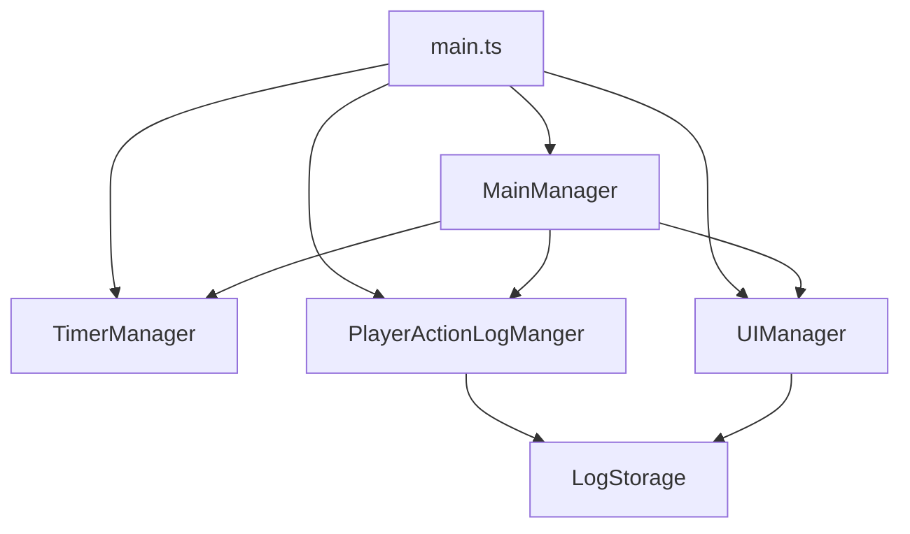
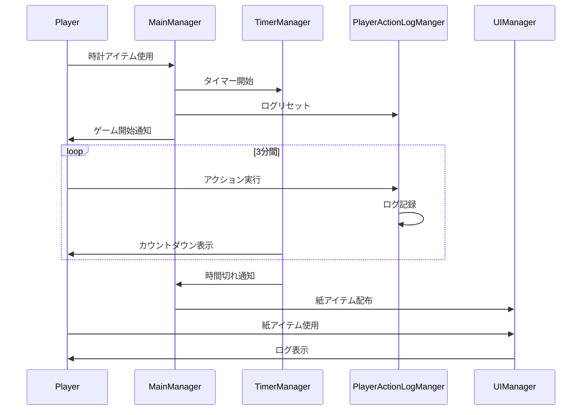

# Minecraft統合版アドオン設計書

## 1. モジュール構成



### モジュール説明

1. `MainManager`
   - ゲーム全体の状態管理
   - イベントハンドリングのエントリーポイント
   - 他のマネージャーの調整

2. `TimerManager` 
   - タイマーの制御
   - カウントダウン表示
   - 時間切れ処理

3. `PlayerActionLogManger`
   - プレイヤーアクションの記録
   - ログデータの保存と取得
   - ログのリセット処理

4. `UIManager`
   - Server-UI表示の制御
   - ログデータの整形表示
   - 紙アイテムの配布制御

5. `LogStorage`
   - ログデータの永続化
   - プレイヤーごとのデータ管理

## 2. データ構造

### GameState
```typescript
interface GameState {
  isRunning: boolean;        // ゲーム実行状態
  startTime: number;         // 開始時刻
  remainingTime: number;     // 残り時間(秒)
}
```

### PlayerLog
```typescript
interface PlayerLog {
  playerId: string;         // プレイヤーID
  actions: PlayerAction[];  // アクション記録
}

interface PlayerAction {
  type: ActionType;         // アクションタイプ
  timestamp: number;        // 実行時刻
  details: any;            // アクション詳細
}

enum ActionType {
  MOVE,
  JUMP,
  ATTACK,
  INTERACT
  // 他必要なアクションタイプ
}
```

### UIState
```typescript
interface UIState {
  isOpen: boolean;          // UI表示状態
  currentPlayerId: string;  // 表示中のプレイヤーID
  pageIndex: number;        // 現在のページ
}
```

## 3. イベントフロー



## 4. 実装方針

### 4.1 初期化処理
```typescript
// main.ts
import { world } from "@minecraft/server";
import { MainManager } from "./MainManager";

// シングルトンインスタンス
let mainManager: MainManager | null = null;

// サーバー起動時の初期化
world.beforeEvents.worldInitialize.subscribe(() => {
  if (!mainManager) {
    mainManager = new MainManager();
  }
});
```

### 4.2 時計アイテムによるゲーム開始
```typescript
// MainManager.ts
import { world, ItemUseEvent } from "@minecraft/server";

class MainManager {
  private isRunning: boolean = false;

  constructor() {
    world.beforeEvents.itemUse.subscribe((event: ItemUseEvent) => {
      if (this.isClockItem(event.itemStack) && !this.isRunning) {
        this.startGame();
      }
    });
  }

  private startGame(): void {
    this.isRunning = true;
    this.timerManager.start();
    this.playerActionLogManger.reset();
    this.broadcastGameStart();
  }
}
```

### 4.3 ログ記録処理
```typescript
// PlayerActionLogManger.ts
class PlayerActionLogManger {
  private logs: Map<string, PlayerLog>;

  constructor() {
    this.logs = new Map();
    this.subscribeToEvents();
  }

  private subscribeToEvents(): void {
    // 移動イベント
    world.afterEvents.entityMove.subscribe((event) => {
      if (event.entity.typeId === "minecraft:player") {
        this.logAction(event.entity.id, ActionType.MOVE);
      }
    });
    // 他のイベント登録
  }
}
```

### 4.4 タイマー処理
```typescript
// TimerManager.ts
class TimerManager {
  private static GAME_DURATION = 180; // 3分
  private remainingTime: number;
  private timerId: number | null = null;

  start(): void {
    this.remainingTime = TimerManager.GAME_DURATION;
    this.timerId = setInterval(() => this.tick(), 1000);
  }

  private tick(): void {
    this.remainingTime--;
    this.updateDisplay();
    if (this.remainingTime <= 0) {
      this.stop();
    }
  }
}
```

### 4.5 UI表示処理
```typescript
// UIManager.ts
import { ActionFormData } from "@minecraft/server-ui";

class UIManager {
  showLog(playerId: string): void {
    const log = this.playerActionLogManger.getPlayerLog(playerId);
    const form = new ActionFormData()
      .title("活動記録")
      .body(this.formatLog(log));
    
    form.show(playerId);
  }
}
```

## 5. 動作確認項目

- [ ] 時計アイテムによるゲーム開始
  - [ ] 二重起動防止の確認
  - [ ] 全プレイヤーへの通知確認

- [ ] アクションログ記録
  - [ ] 移動の記録
  - [ ] ジャンプの記録
  - [ ] 攻撃の記録
  - [ ] インタラクションの記録

- [ ] タイマー機能
  - [ ] 3分のカウントダウン表示
  - [ ] 時間切れの処理確認

- [ ] UI表示機能
  - [ ] 紙アイテムの配布確認
  - [ ] ログ表示UIの動作確認
  - [ ] ページング機能の動作確認

## 6. 注意事項

1. パフォーマンス考慮
   - ログデータは必要最小限に抑える
   - 頻発するイベントはまとめて処理

2. エラーハンドリング
   - イベントリスナーでのエラー補足
   - UIでのエラー表示

3. メモリ管理
   - 定期的なログのクリーンアップ
   - 不要なイベントリスナーの解除