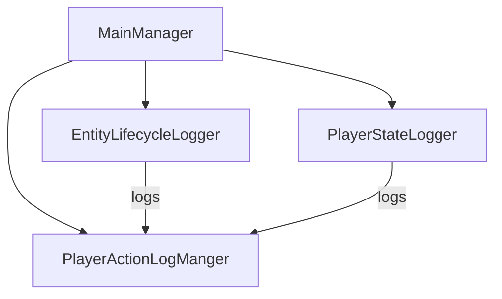

# 設計書: エンティティ生死ログとプレイヤー状態変化ログ

**日付:** 2025-04-15
**設計者:** Roo (Architect Mode)

## 1. 概要

この設計書は、Minecraft Script API を使用して、ワールド内のエンティティのライフサイクルイベント（スポーン、デスポーン、死亡）と、プレイヤーの状態変化（体力、空腹度、経験値、ステータス効果）を記録するための新しいロガー機能の設計を定義するのだ。
これらのロガーは既存の `PlayerActionLogManger` と連携し、統一されたログ管理システムの一部として機能するのだ。

## 2. 共通設計

### 2.1. PlayerActionLogManger との連携

*   新しいロガークラスとして `EntityLifecycleLogger` と `PlayerStateLogger` を作成するのだ。
*   これらのクラスは、初期化時に `PlayerActionLogManger` のインスタンスを受け取るのだ。
*   ログの記録は、受け取った `PlayerActionLogManger` インスタンスの `logAction(playerId: string, type: ActionType, details: unknown)` メソッドを呼び出すことで行うのだ。
    *   エンティティ関連のログでは `playerId` にエンティティの ID を、プレイヤー関連ではプレイヤー ID を使用するのだ。システム起因の場合は `"system"` など、識別可能なIDを使うのだ。
*   `MainManager` が `EntityLifecycleLogger` と `PlayerStateLogger` のインスタンスを保持し、初期化時に `PlayerActionLogManger` を注入する構成にするのだ。



### 2.2. ActionType の追加案

既存の `src/types.ts` 内の `ActionType` enum に、新しいログ種別を追加するのだ。

```typescript
export enum ActionType {
  // ... 既存の ActionType
  MOVE = "move",
  JUMP = "jump",
  ATTACK = "attack",
  INTERACT = "interact",
  BLOCK_BROKEN = "block_broken", // BlockInteractionLogger で使用想定
  BLOCK_PLACED = "block_placed", // BlockInteractionLogger で使用想定
  SCRIPT_EVENT = "script_event", // ScriptEventLogger で使用

  // --- 新規追加案 ---
  ENTITY_SPAWN = "entity_spawn",
  ENTITY_DEATH = "entity_death",
  ENTITY_DESPAWN = "entity_despawn", // デスポーンを検知できる場合
  PLAYER_HEALTH_CHANGE = "player_health_change",
  PLAYER_HUNGER_CHANGE = "player_hunger_change",
  PLAYER_EXPERIENCE_CHANGE = "player_experience_change",
  PLAYER_EFFECT_ADDED = "player_effect_added",
  PLAYER_EFFECT_REMOVED = "player_effect_removed", // 効果除去を検知できる場合
}
```

### 2.3. LogSettings の考慮事項

`PlayerActionLogManger` の `settings.actionTypeSettings` で、新しい `ActionType` ごとのデフォルトログレベルを設定できるようにするのだ。これにより、ユーザーが表示するログレベルを調整できるようになるのだ。

```typescript
// PlayerActionLogManger 内の settings 初期化部分に追加
actionTypeSettings: new Map([
  // ... 既存の設定
  [ActionType.ENTITY_SPAWN, LogLevel.DEBUG], // スポーンはデバッグ情報レベル
  [ActionType.ENTITY_DEATH, LogLevel.INFO],  // 死亡は通常情報レベル
  [ActionType.ENTITY_DESPAWN, LogLevel.DEBUG], // デスポーンはデバッグ情報レベル
  [ActionType.PLAYER_HEALTH_CHANGE, LogLevel.ACTIVITY], // 体力変化はアクティビティレベル
  [ActionType.PLAYER_HUNGER_CHANGE, LogLevel.ACTIVITY], // 空腹度変化はアクティビティレベル
  [ActionType.PLAYER_EXPERIENCE_CHANGE, LogLevel.ACTIVITY], // 経験値変化はアクティビティレベル
  [ActionType.PLAYER_EFFECT_ADDED, LogLevel.INFO], // 効果追加は通常情報レベル
  [ActionType.PLAYER_EFFECT_REMOVED, LogLevel.DEBUG], // 効果除去はデバッグ情報レベル
]),
```

## 3. Entity Lifecycle Logger 設計

### 3.1. 目的

ワールド内のエンティティ（モンスター、動物など、プレイヤーを除く）のスポーン、デスポーン、死亡イベントを記録し、ワールドの動的な変化を追跡可能にするのだ。

### 3.2. 記録する情報

以下の情報をJSON形式で `PlayerActionLogManger.logAction` の `details` に格納するのだ。

```typescript
// ActionType.ENTITY_SPAWN の details
interface EntitySpawnDetails {
  entityId: string; // スポーンしたエンティティの一意なID
  entityType: string; // エンティティの種類 (e.g., "minecraft:zombie")
  location: { x: number; y: number; z: number }; // スポーンした座標
  dimension: string; // スポーンしたディメンションID
}

// ActionType.ENTITY_DEATH の details
interface EntityDeathDetails {
  entityId: string; // 死亡したエンティティの一意なID
  entityType: string; // エンティティの種類
  location: { x: number; y: number; z: number }; // 死亡した座標
  dimension: string; // 死亡したディメンションID
  cause?: string; // 死亡原因 (e.g., "player_attack", "fall", "lava", "entity_attack") - 取得可能な場合
  killerEntityId?: string; // 倒したエンティティのID (プレイヤーや他のエンティティ) - 取得可能な場合
  killerEntityType?: string; // 倒したエンティティのタイプ - 取得可能な場合
}

// ActionType.ENTITY_DESPAWN の details (デスポーンイベントが存在する場合)
interface EntityDespawnDetails {
  entityId: string; // デスポーンしたエンティティの一意なID
  entityType: string; // エンティティの種類
  location: { x: number; y: number; z: number }; // デスポーン時の座標
  dimension: string; // デスポーンしたディメンションID
  reason?: string; // デスポーン理由 (e.g., "distance", "chunk_unload") - 取得可能な場合
}
```

### 3.3. イベントの取得方法

*   **スポーン:** `@minecraft/server` の `world.afterEvents.entitySpawn` イベントを使用するのだ。
    *   イベント引数 (`EntitySpawnAfterEvent`) から `entity` オブジェクトを取得し、`id`, `typeId`, `location`, `dimension.id` を抽出するのだ。
*   **死亡:** `@minecraft/server` の `world.afterEvents.entityDie` イベントを使用するのだ。
    *   イベント引数 (`EntityDieAfterEvent`) から `deadEntity` オブジェクトを取得し、`id`, `typeId`, `location`, `dimension.id` を抽出するのだ。
    *   `damageSource` オブジェクトから死亡原因 (`cause`) や加害エンティティ (`damagingEntity`) の情報を可能な限り抽出するのだ。
        *   `damageSource.cause` を直接利用する。
        *   `damageSource.damagingEntity` が存在すれば、その `id` と `typeId` を `killerEntityId`, `killerEntityType` として記録するのだ。
*   **デスポーン:** `@minecraft/server` に直接的なデスポーンイベントは現在 (API version 1.11.0 時点) 提供されていないようなのだ。代替案として以下を検討するが、実装の複雑さやパフォーマンス影響を考慮し、**今回は実装しない（やらないこと）** とするのだ。
    *   代替案1: 定期的に全エンティティリストを取得し、前回リストとの差分からデスポーンを検出する（パフォーマンス懸念大）。
    *   代替案2: `entityRemove` イベント (もし将来追加されれば) を利用する。

### 3.4. ログフォーマット (JSON 例)

`PlayerActionLogManger` によってラップされる前の、`logAction` に渡す `details` 部分の例なのだ。

```json
// スポーンログの details 例
{
  "entityId": "unique_entity_id_123",
  "entityType": "minecraft:creeper",
  "location": { "x": 10.5, "y": 64.0, "z": -25.2 },
  "dimension": "minecraft:overworld"
}

// 死亡ログの details 例 (プレイヤーによるキル)
{
  "entityId": "unique_entity_id_456",
  "entityType": "minecraft:skeleton",
  "location": { "x": 50.1, "y": 70.0, "z": 100.8 },
  "dimension": "minecraft:overworld",
  "cause": "entityAttack", // entityDie イベントの damageSource.cause
  "killerEntityId": "player_unique_id_789",
  "killerEntityType": "minecraft:player"
}

// 死亡ログの details 例 (落下死)
{
  "entityId": "unique_entity_id_101",
  "entityType": "minecraft:zombie",
  "location": { "x": -15.5, "y": 20.0, "z": 30.3 },
  "dimension": "minecraft:overworld",
  "cause": "fall", // entityDie イベントの damageSource.cause
  "killerEntityId": null, // 加害エンティティなし
  "killerEntityType": null
}
```

### 3.5. やること / やらないこと

*   **やること:**
    *   `EntityLifecycleLogger` クラスを作成するのだ。
    *   `entitySpawn` イベントを購読し、スポーンログを記録するのだ。
    *   `entityDie` イベントを購読し、死亡ログ（原因、加害者情報含む）を記録するのだ。
    *   `PlayerActionLogManger` と連携してログを記録するのだ。
    *   プレイヤーエンティティのイベントは無視するのだ (プレイヤーログは別で管理)。
*   **やらないこと:**
    *   エンティティのデスポーンイベントの記録 (直接的なAPIがないため)。
    *   エンティティの属性変化（体力など）の記録 (Player State Change Logger の範疇)。
    *   ログの永続化（`PlayerActionLogManger` または外部システムが担当）。

### 3.6. 動作確認項目

*   [ ] モンスターが自然スポーンした際に `entity_spawn` ログが記録されること。
*   [ ] スポーンエッグを使用してエンティティをスポーンさせた際に `entity_spawn` ログが記録されること。
*   [ ] プレイヤーがエンティティを倒した際に `entity_death` ログが記録され、`cause` が `entityAttack` (または相当するもの)、`killerEntityId` と `killerEntityType` にプレイヤーの情報が含まれること。
*   [ ] エンティティが落下ダメージで死亡した際に `entity_death` ログが記録され、`cause` が `fall` (または相当するもの) になっていること。
*   [ ] エンティティが溶岩などで死亡した際に `entity_death` ログが記録され、適切な `cause` が記録されること。
*   [ ] プレイヤー自身のスポーンや死亡イベントで `EntityLifecycleLogger` がログを記録しないこと。
*   [ ] 記録されるログの `details` が指定された JSON フォーマットに従っていること。
*   [ ] `PlayerActionLogManger` のフィルター設定やログレベル設定が `entity_spawn`, `entity_death` ログに適用されること。

## 4. Player State Change Logger 設計

### 4.1. 目的

プレイヤーの重要な状態（体力、空腹度、経験値、ステータス効果）の変化を記録し、プレイヤーのゲームプレイ状況やイベント発生の追跡を可能にするのだ。

### 4.2. 記録する情報

以下の情報をJSON形式で `PlayerActionLogManger.logAction` の `details` に格納するのだ。

```typescript
// ActionType.PLAYER_HEALTH_CHANGE の details
interface PlayerHealthChangeDetails {
  previousValue: number; // 変化前の体力値
  currentValue: number; // 変化後の体力値
  maxValue: number; // 最大体力値 (HealthComponent から取得)
  cause?: string; // 体力変化の原因 (ダメージの場合 entityHurt イベントから取得)
  sourceEntityId?: string; // ダメージ源のエンティティID (取得可能な場合)
  sourceEntityType?: string; // ダメージ源のエンティティタイプ (取得可能な場合)
}

// ActionType.PLAYER_HUNGER_CHANGE の details
interface PlayerHungerChangeDetails {
  previousValue: number; // 変化前の空腹度 (FoodComponent.foodLevel)
  currentValue: number; // 変化後の空腹度
  maxValue: number; // 最大空腹度 (FoodComponent.maxFoodLevel)
  previousSaturation: number; // 変化前の隠し満腹度 (FoodComponent.saturationLevel)
  currentSaturation: number; // 変化後の隠し満腹度
}

// ActionType.PLAYER_EXPERIENCE_CHANGE の details
interface PlayerExperienceChangeDetails {
  previousLevel: number; // 変化前の経験値レベル
  currentLevel: number; // 変化後の経験値レベル
  previousProgress: number; // 変化前の次のレベルまでの進捗 (0.0-1.0)
  currentProgress: number; // 変化後の次のレベルまでの進捗
  totalExperience: number; // 現在の総経験値 (Player.getTotalXp())
}

// ActionType.PLAYER_EFFECT_ADDED の details
interface PlayerEffectAddedDetails {
  effectType: string; // 追加された効果のID (e.g., "minecraft:speed")
  amplifier: number; // 効果の強さ (0から始まる)
  duration: number; // 効果の持続時間 (tick単位)
}

// ActionType.PLAYER_EFFECT_REMOVED の details (除去イベントが存在する場合)
interface PlayerEffectRemovedDetails {
  effectType: string; // 除去された効果のID
  reason?: string; // 除去理由 (e.g., "expired", "milk") - 取得可能な場合
}
```

### 4.3. イベントの取得方法

*   **体力変化:**
    *   ダメージ: `@minecraft/server` の `world.afterEvents.entityHurt` イベントを使用するのだ。
        *   イベント引数 (`EntityHurtAfterEvent`) の `hurtEntity` がプレイヤーか確認するのだ。
        *   `hurtEntity.getComponent("minecraft:health")` から変化前後の値を取得するのは難しい場合があるため、ポーリングと組み合わせるか、ダメージ量 (`damage`) を記録する方針も検討するのだ。**今回はポーリングを主とするのだ。**
    *   回復: 直接的な回復イベントはなさそうなので、ポーリングで検知するのだ。
    *   **ポーリング:** `system.runInterval` を使用し、一定間隔 (例: 1秒 = 20 ticks) で全プレイヤーの `HealthComponent` の `currentValue` を監視するのだ。前回の値と比較し、変化があれば `PLAYER_HEALTH_CHANGE` ログを記録するのだ。ダメージイベント (`entityHurt`) が発生した場合は、その情報 (`cause`, `damagingEntity`) をポーリング時のログに付加することも検討するのだ（実装が複雑になる可能性あり）。
*   **空腹度変化:**
    *   直接的なイベントはないため、`system.runInterval` を使用し、一定間隔 (例: 1秒 = 20 ticks) で全プレイヤーの `FoodComponent` (`getComponent("minecraft:food")`) の `foodLevel` と `saturationLevel` を監視するのだ。前回の値と比較し、変化があれば `PLAYER_HUNGER_CHANGE` ログを記録するのだ。
*   **経験値変化:**
    *   直接的なイベントはないため、`system.runInterval` を使用し、一定間隔 (例: 1秒 = 20 ticks) で全プレイヤーの `level`, `xpEarnedAtCurrentLevel / xpNeededForNextLevel` (進捗率), `getTotalXp()` を監視するのだ。前回の値と比較し、変化があれば `PLAYER_EXPERIENCE_CHANGE` ログを記録するのだ。
*   **ステータス効果:**
    *   効果追加: `@minecraft/server` の `world.afterEvents.effectAdd` イベントを使用するのだ。
        *   イベント引数 (`EffectAddAfterEvent`) の `entity` がプレイヤーか確認するのだ。
        *   `effect` オブジェクトから `typeId`, `amplifier`, `duration` を抽出して `PLAYER_EFFECT_ADDED` ログを記録するのだ。
    *   効果除去/変化: 直接的なイベントはないため、`system.runInterval` を使用し、一定間隔 (例: 1秒 = 20 ticks) で全プレイヤーの `getEffects()` を監視するのだ。前回の効果リストと比較し、効果が消えていたり、`amplifier` や `duration` が変化していたりする場合にログを記録するのだ (`PLAYER_EFFECT_REMOVED` または別の変化用 ActionType)。**今回は効果除去のみを対象とする (`PLAYER_EFFECT_REMOVED`) のだ。**

*   **ポーリング実装の注意点:**
    *   各プレイヤーの前回の状態（体力、空腹度、経験値、効果リスト）を `Map<string, PlayerState>` のような形で保持する必要があるのだ。
    *   ポーリング間隔は、ログの粒度とパフォーマンスのトレードオフで決定するのだ (初期値: 20 ticks)。
    *   `MainManager` のゲーム実行状態 (`isRunning`) を確認し、ゲームが停止している間はポーリング処理も停止するようにするのだ。

### 4.4. ログフォーマット (JSON 例)

`PlayerActionLogManger` によってラップされる前の、`logAction` に渡す `details` 部分の例なのだ。

```json
// 体力変化ログの details 例 (ダメージ)
{
  "previousValue": 20.0,
  "currentValue": 15.0,
  "maxValue": 20.0,
  "cause": "entityAttack", // entityHurt イベントから取得できた場合
  "sourceEntityId": "zombie_id_1",
  "sourceEntityType": "minecraft:zombie"
}

// 空腹度変化ログの details 例
{
  "previousValue": 18,
  "currentValue": 17,
  "maxValue": 20,
  "previousSaturation": 5.0,
  "currentSaturation": 4.2
}

// 経験値変化ログの details 例
{
  "previousLevel": 5,
  "currentLevel": 5,
  "previousProgress": 0.8,
  "currentProgress": 0.9,
  "totalExperience": 105 // 仮の値
}

// 効果追加ログの details 例
{
  "effectType": "minecraft:speed",
  "amplifier": 0,
  "duration": 600 // 30秒 * 20 ticks/秒
}

// 効果除去ログの details 例
{
  "effectType": "minecraft:regeneration",
  "reason": "expired" // ポーリングで検知した場合など
}
```

### 4.5. やること / やらないこと

*   **やること:**
    *   `PlayerStateLogger` クラスを作成するのだ。
    *   体力、空腹度、経験値の変化を定期的なポーリングで検知し、ログを記録するのだ。
    *   `effectAdd` イベントを購読し、効果追加ログを記録するのだ。
    *   ステータス効果の除去を定期的なポーリングで検知し、ログを記録するのだ。
    *   `PlayerActionLogManger` と連携してログを記録するのだ。
    *   各プレイヤーの前回の状態を保持する仕組みを実装するのだ。
*   **やらないこと:**
    *   体力変化の原因 (`cause`, `sourceEntity`) を `entityHurt` イベントとポーリング結果を紐付けて詳細に記録すること（初期実装では複雑なため見送り、ポーリングでの値変化のみを記録）。
    *   ステータス効果の `amplifier` や `duration` の変化の記録（追加と除去のみ）。
    *   ログの永続化（`PlayerActionLogManger` または外部システムが担当）。
    *   パフォーマンス影響が大きい場合のポーリング間隔の動的な調整。

### 4.6. 動作確認項目

*   [ ] プレイヤーがダメージを受けた際に `player_health_change` ログが記録され、`previousValue` と `currentValue` が正しいこと。
*   [ ] プレイヤーが食事や自然回復で体力が回復した際に `player_health_change` ログが記録されること。
*   [ ] プレイヤーの空腹度が減少した際に `player_hunger_change` ログが記録されること。
*   [ ] プレイヤーが食事をして空腹度が回復した際に `player_hunger_change` ログが記録されること。
*   [ ] プレイヤーが経験値を獲得した際に `player_experience_change` ログが記録されること。
*   [ ] プレイヤーがエンチャントなどで経験値を消費した際に `player_experience_change` ログが記録されること。
*   [ ] プレイヤーがポーションやビーコンなどでステータス効果を得た際に `player_effect_added` ログが記録されること。
*   [ ] プレイヤーのステータス効果が時間経過で切れた際に `player_effect_removed` ログが記録されること。
*   [ ] プレイヤーが牛乳を飲んで効果を消去した際に `player_effect_removed` ログが記録されること。
*   [ ] ポーリング処理がゲーム停止時に適切に停止・再開すること。
*   [ ] 記録されるログの `details` が指定された JSON フォーマットに従っていること。
*   [ ] `PlayerActionLogManger` のフィルター設定やログレベル設定が各種プレイヤー状態変化ログに適用されること。