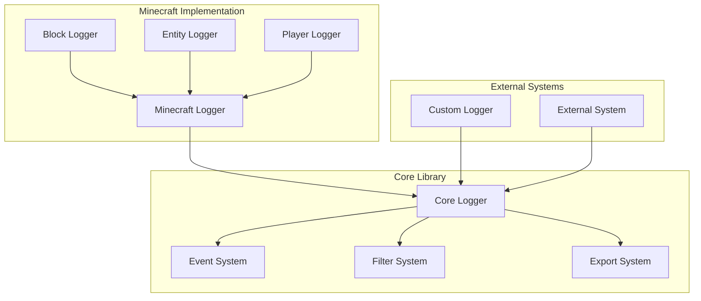

# ActionLogger ライブラリ化設計書

## 概要

ActionLoggerをライブラリとして公開するための設計を行います。現在のMinecraft固有の実装から汎用的なロギング機能を分離し、他のシステムでも利用可能な形式に再構築します。

## 設計方針

### 1. アーキテクチャの分離



### 2. パッケージ構造

```
@minecraft-script/action-logger/
├── core/
│   ├── logger.ts          # コアロギング機能
│   ├── event.ts          # イベントシステム
│   ├── filter.ts         # フィルタリングシステム
│   └── export/           # エクスポート機能
│       ├── json.ts
│       └── csv.ts
├── minecraft/            # Minecraft固有の実装
│   ├── logger.ts
│   ├── block-logger.ts
│   └── entity-logger.ts
└── types/               # 型定義
    ├── core.ts
    ├── events.ts
    └── filters.ts
```

### 3. コアAPIの設計

```typescript
// Core Logger Interface
interface ILogger {
  log(event: LogEvent): void;
  addFilter(filter: LogFilter): void;
  export(format: ExportFormat): Promise<string>;
  getEvents(filter?: LogFilter): LogEvent[];
}

// Base Event Interface
interface LogEvent {
  id: string;
  type: string;
  timestamp: number;
  level: LogLevel;
  details: unknown;
  metadata?: Record<string, unknown>;
}

// Export Format Type
type ExportFormat = 'json' | 'csv' | 'custom';

// Filter Interface
interface LogFilter {
  shouldInclude(event: LogEvent): boolean;
}
```

### 4. 使用例

```typescript
// Core Logger の使用例
import { CoreLogger, TimeRangeFilter } from '@minecraft-script/action-logger/core';

const logger = new CoreLogger();

// イベントの記録
logger.log({
  type: 'user_action',
  details: { action: 'click', target: 'button' }
});

// フィルター適用
logger.addFilter(new TimeRangeFilter(startTime, endTime));

// エクスポート
const jsonData = await logger.export('json');

// Minecraft実装の使用例
import { MinecraftLogger } from '@minecraft-script/action-logger/minecraft';

const mcLogger = new MinecraftLogger();
mcLogger.logPlayerAction(player, 'jump', { height: 1.5 });
```

## 変更範囲と影響

### 1. 既存コードへの影響
- LogManager.ts → MinecraftLogger.ts に移行
- types.ts の分割と再構成
- 既存のフィルター実装の汎用化

### 2. 新規追加コード
- コアロギングシステムの実装
- エクスポートシステムの実装
- 新しい型定義の追加

### 3. インターフェースの変更
- ログ記録メソッドの統一化
- フィルターシステムの抽象化
- エクスポート機能の追加

## 実装計画

### フェーズ1: コアライブラリの実装
- [ ] コアロギングシステムの実装
- [ ] イベントシステムの実装
- [ ] フィルターシステムの実装
- [ ] 基本的なエクスポート機能の実装

### フェーズ2: Minecraft実装の移行
- [ ] MinecraftLoggerの実装
- [ ] 既存機能の移行
- [ ] 既存テストの調整

### フェーズ3: ドキュメント整備
- [ ] API仕様書の作成
- [ ] 使用例の作成
- [ ] 移行ガイドの作成

## 動作確認項目

### コア機能
- [ ] 基本的なログ記録が正常に動作する
- [ ] フィルタリングが正しく機能する
- [ ] エクスポートが正常に動作する

### Minecraft統合
- [ ] 既存の機能が問題なく動作する
- [ ] 新しいAPIとの互換性が保たれている
- [ ] パフォーマンスに影響がない

### エクスポート機能
- [ ] JSON形式でエクスポートできる
- [ ] CSV形式でエクスポートできる
- [ ] カスタムフォーマットの追加が可能

## 期待される利点

1. 汎用性の向上
   - Minecraft以外のシステムでも使用可能
   - カスタムロガーの作成が容易

2. 保守性の向上
   - コア機能と実装の明確な分離
   - テストの容易さ

3. 拡張性の向上
   - 新しいエクスポート形式の追加が容易
   - カスタムフィルターの実装が容易

4. 再利用性の向上
   - 共通のロギング機能を他プロジェクトで利用可能
   - 標準化されたインターフェース

## 今後の展開

1. 追加機能の検討
   - リアルタイムデータストリーミング
   - データベース統合
   - 分散ロギングサポート

2. パフォーマンス最適化
   - バッチ処理の実装
   - メモリ使用量の最適化
   - インデックス機能の追加

3. ツール連携
   - 分析ツールとの連携
   - 可視化ツールとの連携
   - CI/CD統合