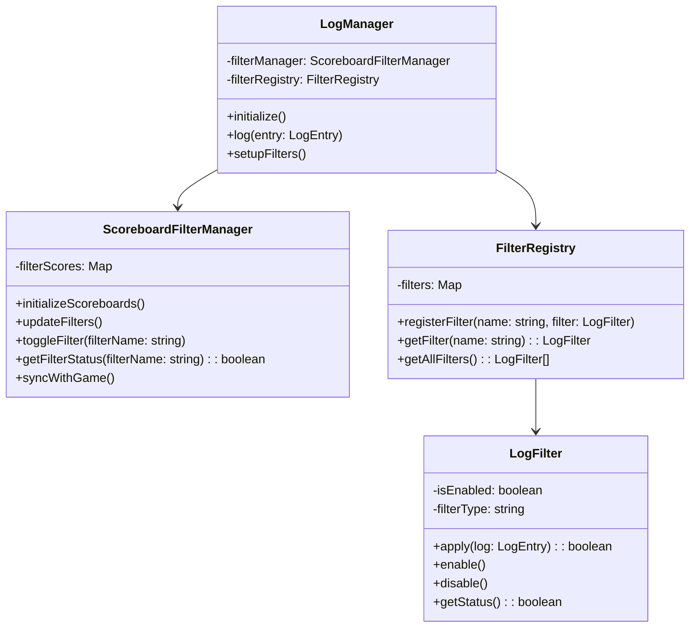

# スコアボードベースのログフィルター制御システム設計

## 目的
Minecraftゲーム内のスコアボードを使用してログフィルターの設定を制御し、パフォーマンスを改善する。

## 基本設計

### 1. スコアボード構造

```typescript
const SCOREBOARD_OBJECTIVE = "log_filters";
const FILTER_PREFIXES = {
  BLOCK: "block",
  ENTITY: "entity",
  PLAYER: "player",
  SCRIPT: "script"
};
```

- スコアボード名: `log_filters`
- 値の意味:
  - 0: フィルター無効
  - 1: フィルター有効

### 2. コアコンポーネント



#### ScoreboardFilterManager
```typescript
export class ScoreboardFilterManager {
  private filterScores: Map<string, number>;
  
  async initializeScoreboards() {
    // スコアボードの初期化
    // 既存の設定があれば読み込み
  }
  
  async updateFilters() {
    // スコアボードの値を監視し、変更があれば反映
  }
  
  async toggleFilter(filterName: string) {
    // フィルターの有効/無効を切り替え
  }
  
  getFilterStatus(filterName: string): boolean {
    // 現在のフィルター状態を返す
  }
}
```

#### LogFilter拡張
```typescript
export interface IScoreboardControlledFilter {
  readonly filterName: string;
  enable(): void;
  disable(): void;
  getStatus(): boolean;
}

export abstract class BaseScoreboardFilter implements IScoreboardControlledFilter {
  constructor(
    readonly filterName: string,
    private enabled: boolean = true
  ) {}
  
  abstract apply(log: LogEntry): boolean;
}
```

## 実装詳細

### 1. フィルター制御システム

#### フィルターの初期化
1. ゲーム開始時にスコアボードを作成
2. デフォルト設定を適用
3. 永続化された設定があれば読み込み

```typescript
// フィルター初期化の例
world.events.worldInitialize.subscribe(() => {
  const scoreboard = world.scoreboard;
  scoreboard.addObjective(SCOREBOARD_OBJECTIVE, "Log Filters");
  
  // デフォルト設定の適用
  Object.values(FILTER_PREFIXES).forEach(prefix => {
    if (!scoreboard.getScore(prefix)) {
      scoreboard.setScore(prefix, 1); // デフォルトで有効
    }
  });
});
```

#### フィルター状態の監視
- 定期的にスコアボードの値をチェック
- 変更があった場合のみフィルターを更新

```typescript
// フィルター状態の監視例
system.runInterval(() => {
  filterManager.updateFilters();
}, 20); // 1秒ごとにチェック
```

### 2. フィルターの適用

#### ログ生成前のチェック
```typescript
export class LogManager {
  async log(entry: LogEntry) {
    // フィルターチェック
    if (!this.shouldLog(entry)) {
      return;
    }
    
    // ログの生成と保存
    await this.saveLog(entry);
  }
  
  private shouldLog(entry: LogEntry): boolean {
    const filter = this.filterRegistry.getFilter(entry.type);
    return filter ? filter.apply(entry) : true;
  }
}
```

### 3. ゲーム内コマンド

#### フィルター制御コマンド
```typescript
// フィルターのON/OFF切り替え
/scoreboard players set <filter_name> log_filters 1  # 有効化
/scoreboard players set <filter_name> log_filters 0  # 無効化

// フィルター状態の確認
/scoreboard objectives setdisplay sidebar log_filters
```

## パフォーマンス最適化

1. フィルターの評価順序の最適化
   - 最も高頻度で発生するイベントのフィルターを最初に評価
   - 複合フィルターの場合、最も制限の厳しいものを先に評価

2. キャッシュの活用
   - フィルター状態のキャッシュ
   - 頻繁に参照される値のメモリ保持

3. 更新の最適化
   - スコアボードの値に変更があった場合のみフィルターを更新
   - バッチ処理による更新の集約

## 動作確認項目

- [ ] スコアボードが正常に初期化される
- [ ] フィルターの有効/無効切り替えが機能する
- [ ] フィルター状態がゲーム再起動後も保持される
- [ ] 無効化されたフィルターに対応するログが生成されない
- [ ] スコアボード表示で現在の状態が確認できる
- [ ] フィルター変更がリアルタイムで反映される
- [ ] パフォーマンスへの影響が最小限に抑えられている

## 今後の拡張性

1. フィルター条件のカスタマイズ
   - より詳細な条件設定のサポート
   - フィルターの組み合わせ機能

2. UI改善
   - フォーム形式での設定インターフェース
   - フィルター状態の視覚的表示

3. モニタリング機能
   - フィルター効果の統計情報
   - パフォーマンスメトリクスの収集

## 制限事項

1. スコアボードの制限
   - 数値のみ扱える
   - 複雑な条件式は直接表現できない

2. 更新頻度
   - スコアボードの監視間隔によるわずかな遅延

3. 永続化
   - ワールドデータに依存
   - バックアップ/リストア時の考慮が必要