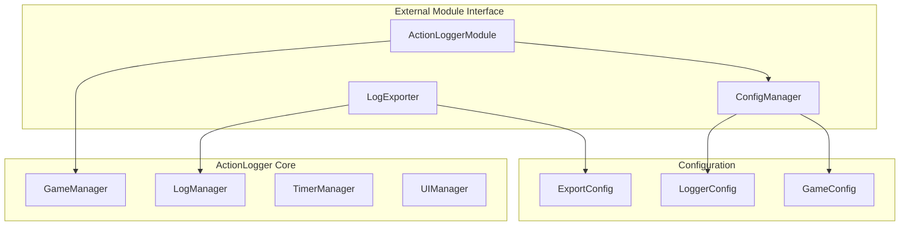

# ActionLogger モジュール設計

## 概要

ActionLoggerをサブモジュールとして使用可能にするための設計です。主な機能として以下を実装します：

1. ログ情報のexport機能
2. 以下の初期設定機能とその読み込み関数
   - 開始アイテム
   - ログ表示アイテム
   - ログフィルタ
   - ゲーム時間

## システム構成



## 型定義

### LoggerConfiguration

```typescript
export interface LoggerConfiguration {
  // ログ表示設定
  displayItems: {
    showTimestamp: boolean;
    showPlayerName: boolean;
    showActionType: boolean;
    showDetails: boolean;
  };
  
  // ログフィルタ設定
  filters: {
    minLogLevel: LogLevel;
    includedActionTypes: ActionType[];
    excludedActionTypes: ActionType[];
    customFilters: LogFilter[];
  };
  
  // ゲーム時間設定
  gameTime: {
    initialTime: number;  // ミリ秒
    timeScale: number;    // 実時間に対する倍率
    dayLength: number;    // 1日の長さ（ミリ秒）
  };
  
  // 開始アイテム設定
  startItems: {
    itemId: string;
    displayName: string;
    canBeUsedByNonOp: boolean;
  }[];
}
```

### ExportConfiguration

```typescript
export interface ExportConfiguration {
  format: 'json' | 'csv' | 'txt';
  includeMetadata: boolean;
  timestampFormat: string;
  outputPath: string;
}
```

## 主要コンポーネント

### 1. ConfigManager

設定の一元管理を行うシングルトンクラス。

主な機能：
- デフォルト設定の初期化
- 設定の更新と取得
- 設定の永続化

### 2. LogExporter

ログデータのエクスポートを担当するクラス。

主な機能：
- 複数フォーマット（JSON/CSV/TXT）でのエクスポート
- メタデータの付加
- カスタマイズ可能な出力形式

### 3. ActionLoggerModule

外部向けのメインインターフェース。

主な機能：
- 設定の初期化と更新
- 各マネージャーの統合管理
- ログエクスポート機能の提供

## 実装の注意点

1. **既存コードとの整合性**
   - 既存のマネージャークラスの機能を最大限活用
   - 型定義の再利用による型安全性の確保

2. **エラーハンドリング**
   - 各操作での適切なエラー処理
   - エラー状態の伝播と回復メカニズム

3. **パフォーマンス**
   - 大量のログデータの効率的な処理
   - メモリ使用量の最適化

## 動作確認項目

- [ ] ConfigManagerの初期化と設定の永続化が正常に動作すること
- [ ] LogExporterが各フォーマットで正常にエクスポートできること
- [ ] ActionLoggerModuleを通じた設定の更新が各マネージャーに正しく反映されること
- [ ] エラーハンドリングが適切に実装されていること

## 今後の拡張性

1. **プラグイン機能**
   - カスタムログフィルターの追加
   - 独自のエクスポートフォーマットの実装

2. **イベントシステム**
   - 設定変更通知
   - ログ記録イベント
   - エクスポート完了通知

3. **インポート機能**
   - 過去のログデータの読み込み
   - 設定のインポート/エクスポート